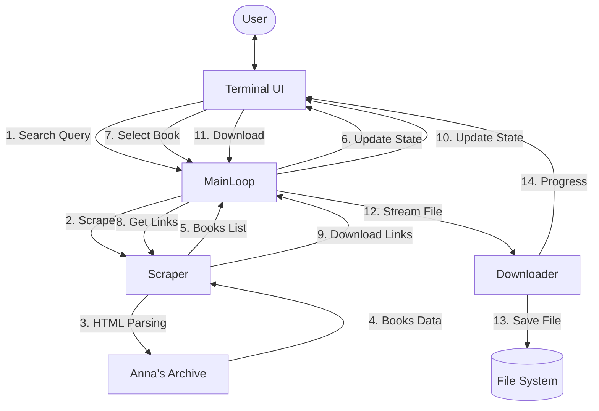

# Nano Banna: Anna's Archive Downloader

## Business Logic Analysis & Fixes
The original business logic had a critical flaw: the UI thread spawned background tasks to scrape and download, but these tasks never communicated their results back to the main application state. The application would "search" but never show results.

**Fix Implemented:** Refactored `ui/app.rs` to delegate heavy lifting to `main.rs` via `AppCommand` channels.
- **Search**: UI sends `AppCommand::Search` -> Main Thread runs Scraper -> Updates State.
- **Links**: UI sends `AppCommand::FetchDownloadLinks` -> Main Thread runs Scraper -> Updates State.
- **Download**: UI sends `AppCommand::Download` -> Main Thread runs Downloader -> Updates State.

## Implementation Flow (Mermaid)

## Nano Banna (Summary)

     _
   //\
   V  \
    \  \_
     \,'.`-.
      |\ `. `.       "We fixed the monkey (Scraper) so it
      ( \  `. `-.     brings the bananas (Books) back to the
       \ \   `.  `-._  basket (App) instead of eating them!"
        \ \    `.    `--..__..---'   _..--.' ,;
         \ \    `.\  _           _.-'   _.'  ;
          \ \     `.( `-.    _.-'     .'     ;
           \ \      `\   `--'        /      ;
            \ \       \             /      ;
             \ \       \           /      ;
              \ \       \         /      ;
               \ \       \       /      ;
                \ \       \     /      ;
                 \ \       \   /      ;
                  \ \       \ /      ;
                   \ \       /      ;
                    \ \     /      ;
                     \ \   /      ;
                      \ \ /      ;
                       \ /      ;
                        ;      ;
                        ;     ;
                        ;    ;
                        /   ;
                       /   ;
                      /   ;
                     /   ;
                    /   ;
                   /   ;
                  /   ;
                 /   ;
                /   ;
               ;   ;
               ;   ;
               ;  ;
               ;  ;
               ; ;
               ;/
