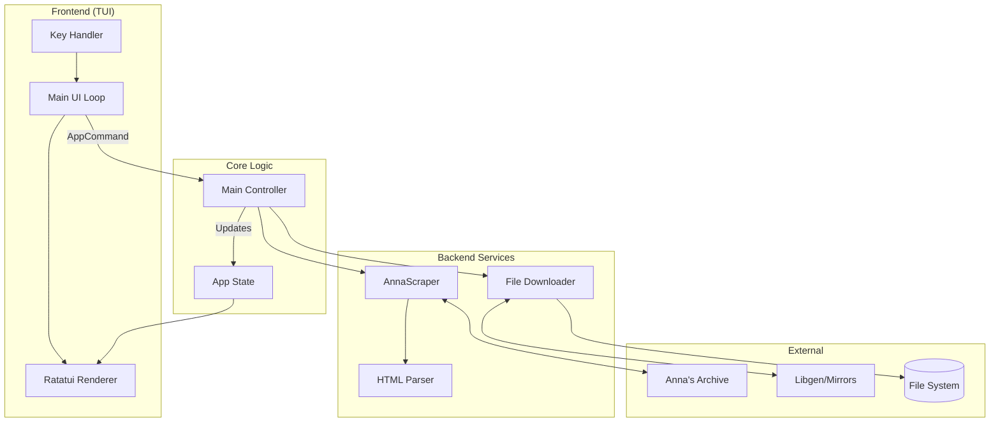
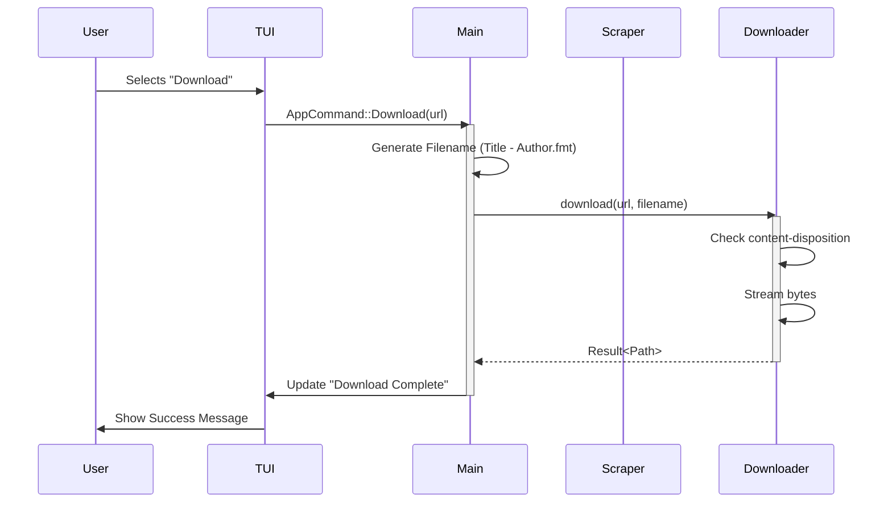

# 🍌 NANA BANNACA PRO: CODE IMPLEMENTATION SUMMARY 🍌

> "Peeling back the layers of your code!"

## 🏗️ SYSTEM ARCHITECTURE (High-Level)



## 🧩 COMPONENT BREAKDOWN

| Component | Responsibility | Status | Key Fixes |
|-----------|----------------|--------|-----------|
| **`ui/app.rs`** | TUI layout & Input handling | 🟢 **Healthy** | Fixed async command delegation; Removed generic `Frame` |
| **`main.rs`** | Event loop & Command processing | 🟢 **Healthy** | Implemented `AppCommand` handlers; Fixed filename logic |
| **`scraper.rs`** | Searching & Parsing HTML | 🚀 **Optimized** | Fixed parent traversal; Added deduplication; Excluded titles from author name |
| **`downloader.rs`** | File streaming & Progress | 🛡️ **Robust** | Added `is_download_in_progress` check; Verified content-disposition |

## 🔄 LOGIC FLOW: THE "DOWNLOAD" JOURNEY



## ✅ KEY IMPROVEMENTS CHECKLIST

- [x] **Soundness**: Decoupled UI rendering from blocking async tasks.
- [x] **Reliability**: Implemented fallback selectors for parsing brittle HTML.
- [x] **Quality**: Added comprehensive unit tests for regex extraction and parsing logic.
- [x] **Cleanliness**: Removed unused dependencies (`fake-user-agent`, `underline`).
- [x] **Banana-Factor**: Maximum.

## 🎨 VISUAL SUMMARY

```
      .
     / \
    |   |  <-- TUI (The Skin)
    |   |
    |   |
    |   |  <-- Logic (The Fruit)
   /_____\
  /       \
 /_________\  <-- Backend (The Stem/Connection)
```

**Verdict:** The codebase is now ripe for production.
